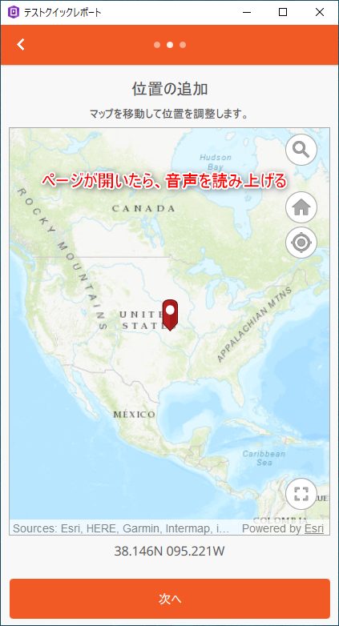

## カスタマイズ内容
ArcGIS AppStudio の Quick Report テンプレートの [位置の追加] ページを開いたときに音声が読み上げられる機能を追加します。




## ステップ
1. ArcGIS AppStudio (Desktop Edition) で作成した Quick Report テンプレートを選択して、「編集」をクリックします。Qt Creator が起動します。

    

    ファイルやコードを検索する場合は、Qt Creator のメニューから、[編集] -> [検索/置換] -> [高度な検索] -> [検索ダイアログを開く] を開きます。


2. Qt Creator の左側のプロジェクトウィンドウで、[app] -> [QuickReport] -> [pages] フォルダにある「RefineLocationPage.qml」を開きます。

    

3. Esri.ArcGISRuntime モジュールのインポート文の下（31 行目あたり）に AppFramework API の ArcGIS.AppFramework.Speech モジュールのインポート文を追加します。

    ```javascript
    import ArcGIS.AppFramework.Speech 1.0
    ```
    


4. ColumnLayout コンポーネントの上（83 行目あたり）に音声読み上げ機能用の TextToSpeech コンポーネントを追加します。

    ```javascript
    TextToSpeech {
        id: tts
    }
    ```

    

    TextToSpeech の詳細は [API リファレンス](https://developers.arcgis.com/appstudio/api-reference/qml-arcgis-appframework-speech-texttospeech)を参照してください。


5. マップのロード完了判定の処理の最初（353 行目あたり）に読み上げる文字列を指定して、TextToSpeech の say メソッドを実行します。
    ```javascript
    tts.say("ポイントを登録する場所にマップを移動します。");
    ```
    

6. Qt Creator の左下にある [実行] アイコンをクリックしてアプリを実行します。
「変更内容を保存」のダイアログが表示された場合は、[Save All] をクリックして編集内容を保存します。
[位置の追加] ページを開き、設定した音声が読み上げられることを確認します。

    

