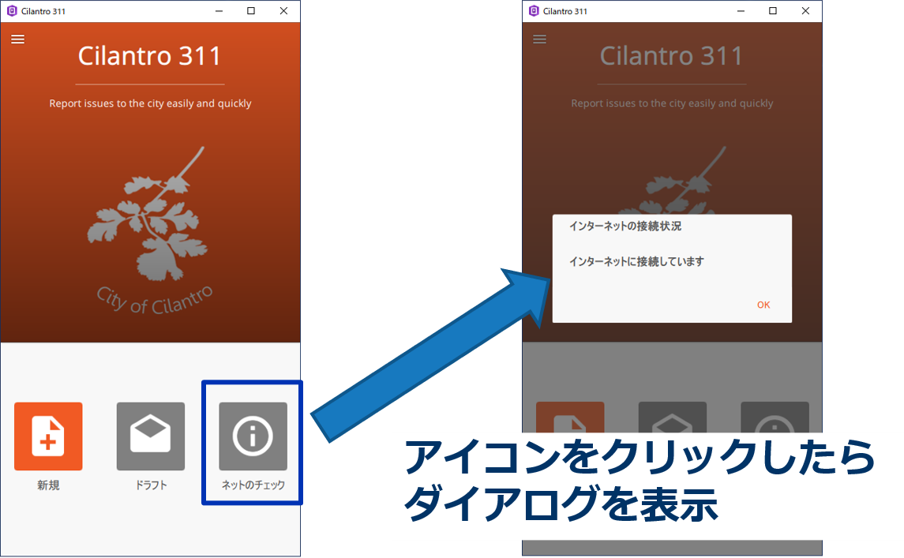
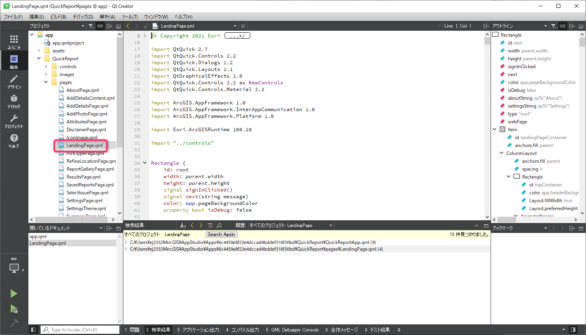
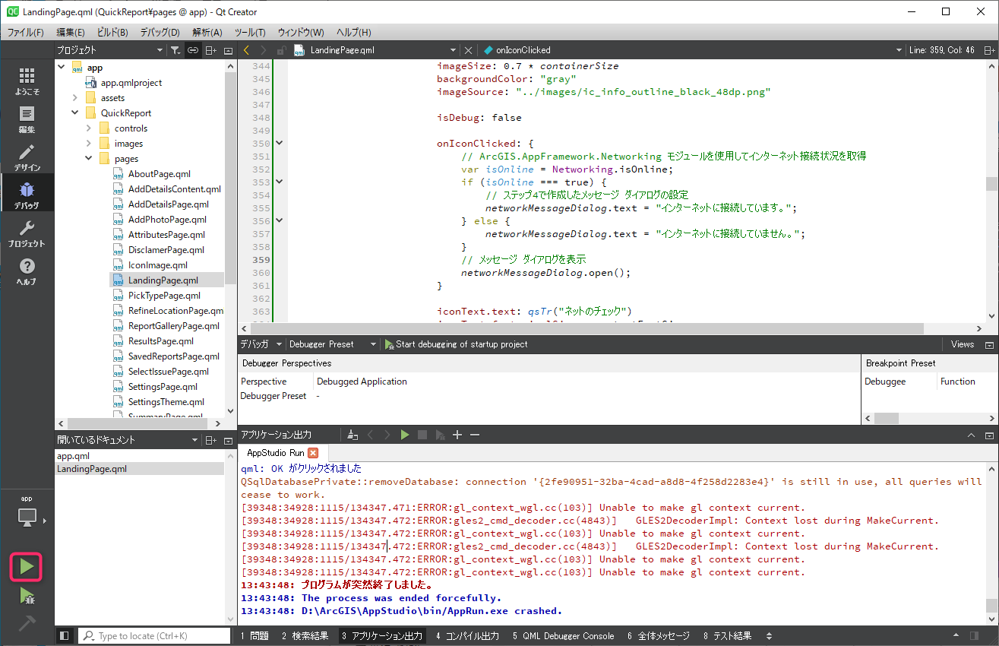

## カスタマイズ内容
ArcGIS AppStudio の Quick Report テンプレートにインターネットの接続状況を表示する機能を追加します。




## ステップ
1. ArcGIS AppStudio (Desktop Edition) で作成した Quick Report テンプレートを選択して、「編集」をクリックします。Qt Creator が起動します。

    

    ファイルやコードを検索する場合は、Qt Creator のメニューから、[編集] -> [検索/置換] -> [高度な検索] -> [検索ダイアログを開く] を開きます。


2. Qt Creator の左側のプロジェクトウィンドウで、[app] -> [QuickReport] -> [pages] フォルダにある「LandingPage.qml」を開きます。

    

3. 「ドラフト」Icon 要素の下（330 行目あたり）にインターネット接続状況確認用の Icon 要素を追加します。

    ```javascript
    Icon {
        containerSize: app.isSmallScreen ? app.units(96) : app.units(112)
        imageSize: 0.7 * containerSize
        backgroundColor: "gray"
        imageSource: "../images/ic_info_outline_black_48dp.png" // アイコンに表示する画像

        isDebug: false

        // アイコンのクリック時の処理
        onIconClicked: {

        }

        iconText.text: qsTr("ネットのチェック") // アイコンに表示するテキスト
        iconText.font.pixelSize: app.textFontSize
        iconText.font.family: app.customTextFont.name
        iconText.color: app.textColor
        bubbleCount: app.savedReportsCount
        bubbleColor: app.buttonColor
    }
    ```


4. インターネットの接続状況を表示するメッセージ ダイアログ（MessageDialog 要素）を作成します。Rectangle 配列の中（50 行目あたり）に下記を追加します。

    ```javascript
    MessageDialog {
        id: networkMessageDialog　// メッセージ ダイアログの一意の ID
        title: "インターネットの接続状況" // メッセージ ダイアログの任意のタイトル
        // text: "固定の場合はここで指定" // 今回はアイコンのクリック時の関数内で設定するのでコメントアウト
        onAccepted: {
            console.log("OK がクリックされました")
        }
        Component.onCompleted: visible = true
    }
    ```

    MessageDialog の詳細は Qt の[リファレンス](https://doc.qt.io/qt-5/qml-qtquick-dialogs-messagedialog.html)を参照してください。


5. AppFramework API の ArcGIS.AppFramework.Networking モジュールをインポートします。LandingPage.qml の先頭（30 行目あたり）に import 文を追加します。
    ```javascript
    import ArcGIS.AppFramework.Networking 1.0
    ```

6. ステップ3で追加した Icon 要素の onIconClicked イベントにアイコンのクリック時の処理（インターネット接続状況をステップ4で作成したメッセージ ダイアログに表示）を追加します。

    ```javascript
    onIconClicked: {
        // ArcGIS.AppFramework.Networking モジュールを使用してインターネット接続状況を取得
        var isOnline = Networking.isOnline;
        if (isOnline === true) {
            // ステップ4で作成したメッセージ ダイアログの設定
            networkMessageDialog.text = "インターネットに接続しています。";
        }　else {
            networkMessageDialog.text = "インターネットに接続していません。";
        }
        // メッセージ ダイアログを表示
        networkMessageDialog.open();
    }
    ```

    Networking モジュールの isOnline プロパティの詳細はAppStudio Framework API の[リファレンス](https://developers.arcgis.com/appstudio/api-reference/qml-arcgis-appframework-networking-networking/#isOnline-prop)を参照してください。


7. Qt Creator の左下にある [実行] アイコンをクリックしてアプリを実行します。[ネットのチェック] アイコンをクリックして動作を確認します。
「変更内容を保存」のダイアログが表示された場合は、[Save All] をクリックして編集内容を保存します。

    


